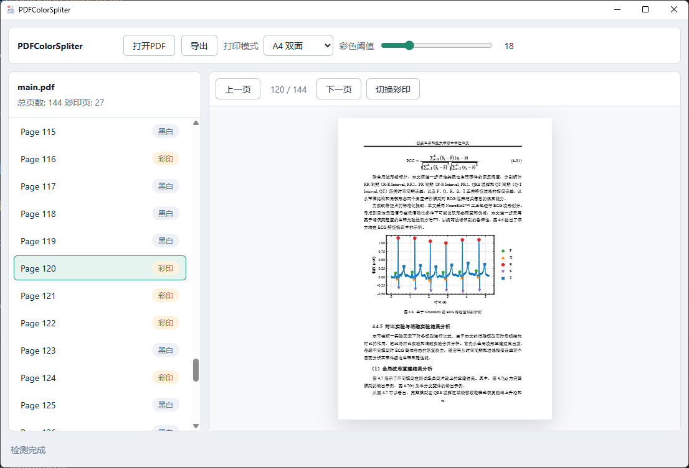

# PDFColorSpliter



PDFColorSpliter 用于找出 PDF 中需要彩印的页面，并把原文件拆分成两个打印文件：黑白打印 PDF 和彩色打印 PDF。

它适合在只有部分页面需要彩印时使用，减少手动挑页和反复检查的麻烦。

## 主要功能

- 自动检测 PDF 中的彩色页面
- 按纸张拆分黑白和彩印任务
- 支持 A4 双面打印
- 支持 A3 书册打印
- 可手动指定某些页面为彩印或黑白

## 使用构建好的程序

构建好的程序只有一个文件：

```text
PDFColorSpliter.exe
```

双击 `PDFColorSpliter.exe` 会打开图形界面。

打开界面后：

1. 点击“打开PDF”选择文件
2. 检查自动识别出的彩印页面
3. 如有需要，手动切换页面的黑白/彩印状态
4. 选择打印模式
5. 点击“导出”生成打印文件

也可以在终端中带参数运行，进入命令行模式。

检测并拆分 PDF：

```bash
PDFColorSpliter.exe test/main.pdf -o output --mode a4
```

使用 A3 书册模式：

```bash
PDFColorSpliter.exe test/main.pdf -o output --mode booklet
```

只检测彩页，不导出文件：

```bash
PDFColorSpliter.exe test/main.pdf --detect-only
```

手动指定页面：

```bash
PDFColorSpliter.exe test/main.pdf -o output --color-pages 3,4,8-10 --bw-pages 12
```

## 输出文件

导出后会生成：

```text
document_bw.pdf
document_color.pdf
print_instructions.txt
```

其中：

- `document_bw.pdf` 用于黑白打印
- `document_color.pdf` 用于彩色打印
- `print_instructions.txt` 记录打印模式和彩印页信息

## 从源文件运行

如果你拿到的是源代码，可以用 `uv` 运行：

```bash
uv run pdfcolorspliter
```

带参数时进入命令行模式：

```bash
uv run pdfcolorspliter test/main.pdf --detect-only
```

也可以在普通 Python 环境中安装依赖后运行：

```bash
python -m pdfcolorspliter.main
```

带参数时同样进入命令行模式：

```bash
python -m pdfcolorspliter.main test/main.pdf --detect-only
```

## 打印规则

拆分逻辑以一张纸为单位。只要一张纸上的任意页面需要彩印，这张纸上的所有页面都会进入彩印 PDF；否则进入黑白 PDF。

A3 书册模式不会自动补空白页。
